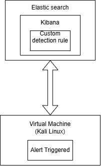
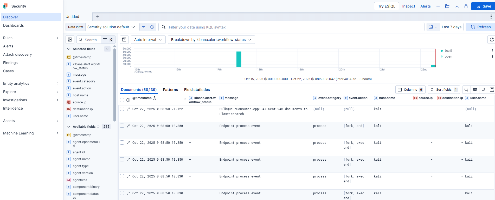

# CS_Project1
Monitoring setup with a virtual machine and Elasticsearch. Custom detection rule tracks specific log events from the VM and automatically triggers alerts in Kibana.

## Architecture

## Part Elastic
Setting up Elastic Defend Integration

* * Follow these steps to connect your virtual machine and enable alert detection in Elasticsearch:

### 1) Log in to your Elastic Cloud account
Open your Elastic dashboard and choose the desired deployment.

### 2) Go to "Add integrations"
From the main menu, click “Add integrations” to open the integration catalog.

### 3) Select “Elastic Defend”
Use the search bar or scroll through the list to find Elastic Defend,
which provides endpoint security and alerting capabilities.

### 4) Click “Add Elastic Defend”
This opens the configuration wizard for the integration.

### 5) Configure the integration

Choose or create an agent policy.
(Optional) Adjust settings such as malware protection, event collection, etc.
Click “Save and continue”.

### 6) Follow the provided steps
Copy the Elastic Agent installation command from the instructions.
Run it on your virtual machine (Linux/Ubuntu).
Once connected, your VM will start sending logs and security events to Elasticsearch.

### 7) Verify connection
Open Kibana → Discover.
Here you will see incoming logs and events from your virtual machine — such as process activity, hostnames, source IPs, usernames, and timestamps.

