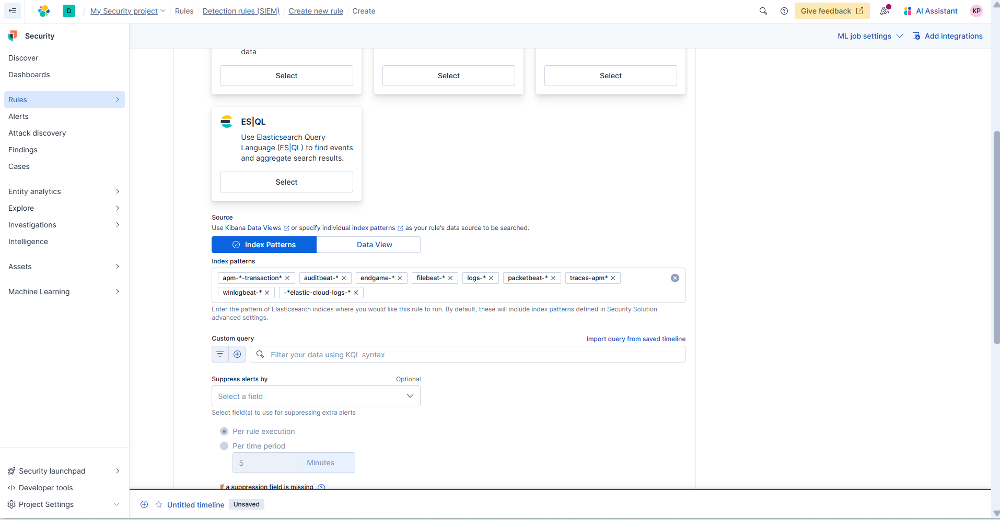

# CS_Project1
Monitoring setup with a virtual machine and Elasticsearch. Custom detection rule tracks specific log events from the VM and automatically triggers alerts in Kibana.

## Architecture

## Part VM (Kali)

### 1) Download Virtual Box 
Download actual version of Virtual Box for your PC architecture
Link: https://www.virtualbox.org/wiki/Downloads

### 2) Download Kali Linux
Download last actual version of Kali Linux. Pre-bild recomended.
Link: https://www.kali.org/get-kali/#kali-platforms

### 3) Importing Kali VM into VirtualBox
Follow steps here: https://www.kali.org/docs/virtualization/import-premade-virtualbox/
*Credentials: 
Login: kali
Password: kali*

## Part Elastic
Setting up Elastic Defend Integration

*Follow these steps to connect your virtual machine and enable alert detection in Elasticsearch:*

### 1) Log in to your Elastic Cloud account
Open your Elastic dashboard and choose the desired deployment.

### 2) Go to "Add integrations"
From the main menu, click “Add integrations” to open the integration catalog.

### 3) Select “Elastic Defend”
Use the search bar or scroll through the list to find Elastic Defend,
which provides endpoint security and alerting capabilities.

### 4) Click “Add Elastic Defend”
This opens the configuration wizard for the integration.

### 5) Configure the integration
Choose or create an agent policy.
(Optional) Adjust settings such as malware protection, event collection, etc.
Click “Save and continue”.

### 6) Follow the provided steps
Copy the Elastic Agent installation command from the instructions.
Run it on your virtual machine (Linux/Ubuntu).
Once connected, your VM will start sending logs and security events to Elasticsearch.

### 7) Verify connection
Open Kibana → Discover.
Here you will see incoming logs and events from your virtual machine — such as process activity, hostnames, source IPs, usernames, and timestamps.

## Part Create Rule
### 1) Create a New Rule

### 2) Set up the rule 

* Name
* Description
* Index patterns: logs-* or select your agent’s data stream
* Custom query: 
*process.name : "nmap" OR event.action : "exec" AND message : "*nmap*"*
* Set the Schedule
* Define Actions
* Save and Enable

After a few minutes, the rule will start analyzing incoming events, .

### 7) Verify Alerts
From the virtual machine, run a command that will trigger the alert (nmap -A -sv localhost), and then check if the alert message appears in **Alerts**.

